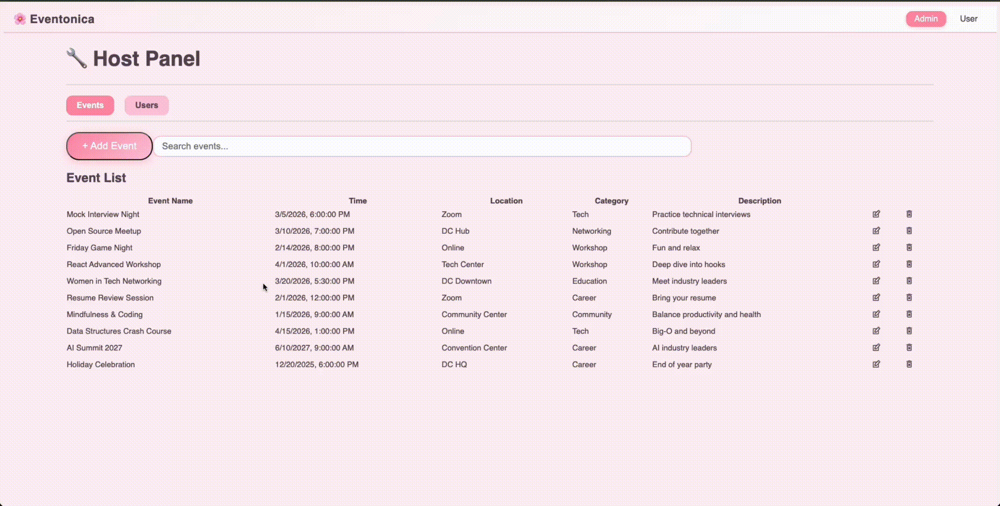

# Eventonica

## Overview

Eventonica is a full-stack event management web application built with React, Express, and PostgreSQL.

Users can:
- Browse and search events
- Filter by category or date
- Favorite / unfavorite events

Managers can:
- Create, update, and delete events
- View users


## Demo 


## Tech Stack

- Frontend: React, JavaScript, CSS
- Backend: Node.js, Express
- Database: PostgreSQL
- Other: REST API, useReducer state management


## Features

- View all events
- Search events by name, category, or date
- Filter events by category
- Favorite / unfavorite events
- Create, update, and delete events
- Persistent storage using PostgreSQL
- Global state management with useReducer

## API Endpoints
### Events
GET /api/events  
POST /api/events  
PUT /api/events/:id  
DELETE /api/events/:id  
GET /api/events/search?params

### Users
GET /api/users  
GET /api/users/:id/favorites  
POST /api/users/:id/favorites
DELETE /api/users/:id/favorites/:eventId
### Categories
GET /api/categories

## Database Schema

- **events** — stores event details  
- **users** — stores users  
- **categories** — event categories  
- **user_favorites** — many-to-many relation between users and events

## Testing
Test will be added to cover frontend components, backend routes, api endpoints. 

## Future Improvements
- User authentication
- Role-based access control
- Deployment to cloud


## How to start?

### Database Setup
You can initilize the database using either method below

#### Method 1: Restore from dump(recommended)
```bash
# Drop database if it exists
dropdb --if-exists eventonica

# Create a fresh database
createdb eventonica

# Restore database from dump
psql -d eventonica -f server/db/db_dump.sql
```

#### Method 2: Run schema + seed manually
```bash
# Drop database if it exists
dropdb --if-exists eventonica

# Create database
createdb eventonica

# Create schema and tables
psql -d eventonica -f server/db/schema.sql

# Insert seed data
psql -d eventonica -f server/db/seed.sql
```

### Environment Variable
Create a .env file inside the `server` folder:
```bash
DATABASE_URL=postgresql://localhost:5432/eventonica
PORT=3001
```

### Start the App
```bash
# Start backend
cd server
npm install
npm run dev

# Start frontend
cd ../client
npm install
npm run dev
```

### Note
If you encounter database permission or role errors, ensure PostgreSQL is installed and running, and your local user has permission to create databases.